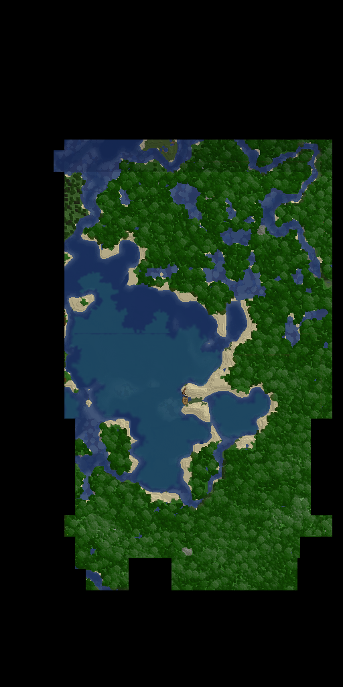

## 1.1
Removed the EXE because I could not package it's dependencies with it, sorry

### Usage
## Installation
- You will need NodeJS installed, I used version 13.13.0
- Download this folder from git using the clone / download button
- open a command line window in this folder,
- run `npm install`

## Running script
1. You will need to launch your game with voxelmap installed
1. open `\mods\mamiyaotaru\voxelmap.properties` in a text editor and add the line `Output Images:true`
    * this will disappear each time you restart you game client so you will need to add it again 😞
1. move around the area you want to map
1. leave the world to save the explored regions to disk
1. run `node main.js C:\Users\Keris\Twitch\Minecraft\Instances\fabricWithVoxelmap\mods\mamiyaotaru\voxelmap\cache\test\overworld\images\z1` except obviously replace the path with the path to your modded minecraft directory
1. if everything works, you will get an out.png file in the script's folder

### Notes
- When using MamiyaOtaru's anvilmapper to get larger images edit line 13 in main.js from const regionSize = 256 for z1 to one of the following:
  - 4096 for z0.0625
  - 2048 for z0.125
  - 1024 for z.025
  - 512 for z0.5
  - 128 for z2
  - 64 for z4
  - 32 for z8

